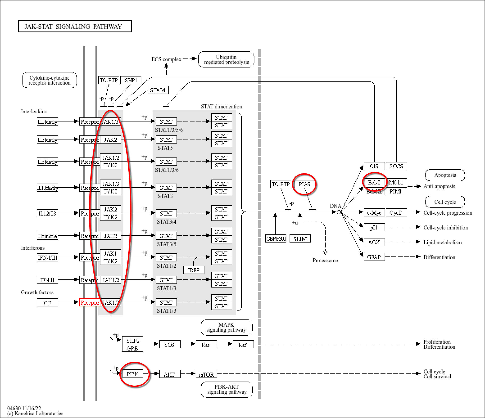

In this Logbook you can find the flow of the minor me and Ramon are doing. 

We are doing an research about the affect of different drugs with in the ROS1-positive NSCLC

The ROS1 gene is normally not actively expressed in most human adult tissues. Under normal physiological conditions, ROS1 activity is very low or absent, meaning it does not continuously send growth signals to cells.

However, genomic alterations such as **chromosomal rearrangements** or **gene fusions** 
can lead to abnormal activation of ROS1. These mutations place the ROS1 kinase domain 
under the control of an alternative promoter or create a constitutively active fusion protein. 
As a result, the ROS1 gene becomes transcribed and translated, leading to persistent expression of an active receptor tyrosine kinase.

Activated ROS1 continuously sends intracellular signals independent of normal regulatory mechanisms. 
This results in activation of multiple downstream signaling pathways.

Continuous activation of these pathways promotes cell proliferation, survival, and resistance to apoptosis. 
Over time, this uncontrolled signaling can contribute to tumor initiation and cancer progression.

The lab asked us to look at some interesting genes and make primes for them. 

In the powerpoint presentaion we got where some genes shown with intresting interaction 
with in the patways. We are goinig to use these given pathways to look to intresting genes. 

Ofcourse we need ros1 

Based on the pathways provided in the PowerPoint presentation, several genes were
selected that show important interactions within the PI3K–AKT, MAPK, and JAK–STAT
signaling pathways. These genes were chosen because of their roles in signal
transduction, cell growth, survival, and apoptosis regulation.

### PI3K–AKT Signaling Pathway

| Gene | Why |
|------|-----|
| **AKT** | Central kinase in the pathway that regulates many downstream cellular processes including survival and growth. |
| **GRB2** | Early adaptor protein linking receptor activation to downstream signaling; also involved in the MAPK pathway, allowing pathway comparison. |
| **PI3K** | Key signaling molecule that integrates multiple upstream signals and activates AKT. |
| **MDM2** | Regulates the tumor suppressor protein p53 and influences cell cycle control. |
| **FOXO3** | Transcription factor involved in cell survival, metabolism, and cell cycle regulation. |
| **GSK3B** | Downstream target of AKT involved in metabolism and cell proliferation regulation. |
| **TSC1/TSC2** | Protein complex regulating mTOR signaling and cellular growth control. |

  

### MAPK Signaling Pathway

| Gene | Why |
|------|-----|
| **GRB2** | Shared component with the PI3K–AKT pathway, enabling comparison between signaling routes. |
| **RAS** | Important regulator of cell proliferation and signal amplification. |
| **MEKK1** | Kinase involved in transmitting signals downstream within the MAPK cascade. |

### JAK–STAT Signaling Pathway

| Gene | Why |
|------|-----|
| **TYK2** | Identified in the presentation as an important signaling kinase within the pathway. |
| **JAK1/2** | Early signaling kinases essential for pathway activation and signal propagation. |
| **PI3K** | Acts as a signaling integration point connecting JAK–STAT with other pathways. |
| **BCL2** | Anti-apoptotic protein promoting cell survival. |
| **PIAS** | Negative regulator that inhibits STAT signaling and limits pathway activation. |

